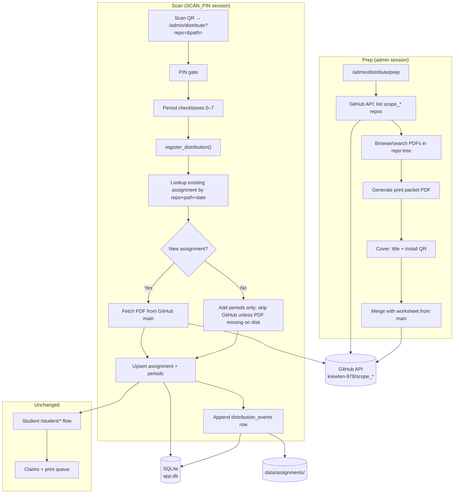

# Phase 8: GitHub Worksheet Distribution Ledger

| Field | Value |
|-------|-------|
| **Author** | TBD |
| **Date** | 2026-07-06 |
| **Status** | Draft |
| **Project** | Homework Makeup (`homeDump`) |
| **Phase** | 8 |

---

## Overview

Teachers maintain class worksheets in private GitHub repos under `krewten-978` (e.g. `scope_tenth`) but today must manually re-upload PDFs via `/admin/assignments/new`. Phase 8 adds a **parallel FedEx-style distribution workflow**: prep a print packet from GitHub (cover sheet + worksheet), scan an install QR on distribution day to register assignments, and maintain an append-only audit ledger — while preserving the existing manual upload path unchanged.

The install QR encodes a stable locator (`repo` + `path` on `main`), not periods or dates. Registration happens only after a teacher scans the QR and enters a 4-digit `SCAN_PIN`, preventing students who receive the cover sheet from self-registering assignments. Student-facing flows (`/`, `/student/*`, `/verify/{token}`) are untouched.

---

## Background & Motivation

### Current state

| Component | Location | Behavior |
|-----------|----------|----------|
| Manual assignment upload | `app/routers/admin.py` → `create_assignment()` | Teacher selects periods, date, title, PDF; stored under `data/assignments/{id}/original.pdf` |
| Assignment schema | `app/database.py` | `assignments` + `assignment_periods`; no provenance field |
| Student eligibility | `app/services/eligibility.py` | Gates claims by `ALLOWABLE_ABSENCE_CODES` |
| Claim QR URLs | `app/public_url.py` → `resolve_public_base_url()` | Example production value: `http://homework.local:8000` (set in server `.env`; not in repo) |
| Admin auth | `app/dependencies.py` | HMAC cookie from `SECRET_KEY`, 7-day `admin_token` |
| Audit logging precedent | `claim_logs` table + `app/services/claim_logs.py` | Append-only teacher review UI at `/admin/claims` |

### Pain points

1. **Duplicate work** — worksheets already live in GitHub; teachers download and re-upload PDFs weekly.
2. **No distribution audit** — manual uploads record *what* was assigned but not *when the teacher physically distributed* worksheets to classes.
3. **Chaotic distribution days** — same worksheet may go to different periods across multiple scans; current manual flow requires foreknowledge of all periods at upload time.

### FedEx mental model

```
Prep (admin)     →  Print packet (cover QR + worksheet)  →  No DB assignment yet
Scan (PIN gate)  →  Register assignment(s) for periods   →  Ledger event appended
Student claim    →  Existing flow unchanged                →  Watermarked PDF + verify QR
```

---

## Goals & Non-Goals

### Goals

- Browse private `scope_*` repos via GitHub API; prep printable packets (cover + PDF from `main`).
- Scan workflow registers assignments with `assigned_date = scan calendar day`.
- Idempotent period merging: same `(repo, path, assigned_date)` → one assignment row; new periods appended; duplicate periods silently skipped.
- Append-only `distribution_events` ledger with admin review page.
- Assignments list distinguishes `manual` vs `github` source.
- Read-only GitHub token in `.env`; prep requires admin session; scan requires `SCAN_PIN` session cookie.
- Incremental PRs; no nginx changes; deploy via `git pull` + server `.env` update.

### Non-Goals

- Student access to GitHub browsing or repo metadata.
- Branch/tag pinning (always `main`).
- Non-PDF file conversion or ingestion.
- Replacing manual upload workflow.
- Webhook-driven auto-sync from GitHub pushes.
- Caching GitHub PDFs between prep and scan.
- Re-fetching GitHub PDF on same-day rescans when the assignment already exists (only the **first** registration for a given `(repo, path, assigned_date)` fetches from `main`).

---

## Proposed Design

### High-level architecture



### Sequence: scan → assignment registration

```mermaid
sequenceDiagram
    participant T as Teacher phone/browser
    participant App as FastAPI
    participant GH as GitHub API
    participant DB as SQLite

    T->>App: GET /admin/distribute?repo=scope_tenth&path=unit2/ch04.pdf
    App->>T: PIN form (no session cookie)
    T->>App: POST /admin/distribute/pin (4-digit)
    App->>T: Set scan_token cookie; show distribute form

    T->>App: POST /admin/distribute (periods=[1,3])
    App->>App: assigned_date = today (ISO); validate_periods()
    App->>GH: list_filtered_repos() — verify repo in allowlist
    App->>DB: find_github_assignment(repo, path, assigned_date)
    alt No existing assignment
        App->>GH: GET contents .../unit2/ch04.pdf?ref=main
        GH-->>App: PDF bytes (base64 or download_url)
        App->>DB: INSERT assignments (source=github, ...)
        App->>DB: INSERT assignment_periods
    else Existing assignment
        opt original.pdf missing on disk
            App->>GH: GET contents (repair fetch)
        end
        App->>DB: INSERT OR IGNORE assignment_periods
    end
    App->>DB: INSERT distribution_events
    App->>DB: COMMIT
    opt pdf_bytes pending (new or repair)
        App->>FS: Write original.pdf (post-commit only)
    end
    App->>T: Success summary page
```

---

### Configuration

Extend `app/config.py` `Settings` dataclass and `.env.example`:

| Variable | Default | Purpose |
|----------|---------|---------|
| `GITHUB_TOKEN` | `None` | Read-only PAT for private repo access |
| `GITHUB_OWNER` | `krewten-978` | Org/user owning worksheet repos |
| `GITHUB_REPO_FILTER` | `scope` | Substring filter for repo dropdown |
| `SCAN_PIN` | `None` | Exactly 4 digits; separate from `ADMIN_PASSWORD` |

Neither variable is required for app startup — GitHub distribution is **opt-in** via `.env`. Manual upload always works.

#### Config validation matrix

| Variable | Missing | Malformed |
|----------|---------|-----------|
| `GITHUB_TOKEN` | `settings.github_enabled = False`; hide prep nav links; scan/distribute pages show "GitHub not configured — contact teacher" (no PIN form); prep routes redirect to dashboard with message | N/A (any non-empty string accepted) |
| `SCAN_PIN` | `settings.scan_enabled = False`; `GET /admin/distribute` shows config error (not PIN form); `POST /admin/distribute` returns 503; prep unaffected | **Fail fast** at import: `ValueError("SCAN_PIN must be exactly 4 digits.")` — prevents a PIN form that can never succeed |

#### Settings integration

Parsing lives in `app/config.py` module helpers; properties are set on the frozen `Settings` dataclass:

```python
def _parse_scan_pin(raw: str | None) -> str | None:
    if not raw:
        return None
    pin = raw.strip()
    if len(pin) == 4 and pin.isdigit():
        return pin
    raise ValueError("SCAN_PIN must be exactly 4 digits.")

@dataclass(frozen=True)
class Settings:
    ...
    github_token: str | None = field(default_factory=lambda: os.getenv("GITHUB_TOKEN") or None)
    scan_pin: str | None = field(default_factory=lambda: _parse_scan_pin(os.getenv("SCAN_PIN")))

    @property
    def github_enabled(self) -> bool:
        return bool(self.github_token)

    @property
    def scan_enabled(self) -> bool:
        return self.github_enabled and bool(self.scan_pin)
```

`settings = Settings()` construction runs at import time (same pattern as today). Malformed `SCAN_PIN` prevents startup with a clear log message. Missing vars log a single INFO line at startup via `lifespan` in `app/main.py`:

```python
if not settings.github_enabled:
    logger.info("GitHub distribution disabled (GITHUB_TOKEN not set).")
elif not settings.scan_enabled:
    logger.info("Distribution scan disabled (SCAN_PIN not set).")
```

**Risk (medium):** Misconfigured `GITHUB_TOKEN` blocks prep and scan. **Mitigation:** Explicit UI disable states; manual upload remains available.

---

### Data model changes

#### `assignments` table extensions

Add via `_apply_migrations()` in `app/database.py` (matching existing migration pattern):

```sql
ALTER TABLE assignments ADD COLUMN source TEXT NOT NULL DEFAULT 'manual';
ALTER TABLE assignments ADD COLUMN github_repo TEXT;
ALTER TABLE assignments ADD COLUMN github_path TEXT;
```

Constraints and index:

```sql
CREATE UNIQUE INDEX IF NOT EXISTS idx_assignments_github_identity
ON assignments (github_repo, github_path, assigned_date)
WHERE source = 'github' AND github_repo IS NOT NULL;
```

| `source` | `github_repo` | `github_path` | Meaning |
|----------|---------------|---------------|---------|
| `manual` | `NULL` | `NULL` | Existing upload flow |
| `github` | e.g. `scope_tenth` | e.g. `unit2/ch04.pdf` | Registered via scan |

**Title:** `assignments.title` stores the display title at registration time (derived from path; see below). `pdf_filename` stores `Path(github_path).name`.

#### `distribution_events` table (new)

Append-only ledger; never updated or deleted by application code.

```sql
CREATE TABLE IF NOT EXISTS distribution_events (
    id INTEGER PRIMARY KEY,
    scanned_at TEXT NOT NULL DEFAULT (datetime('now')),
    assigned_date TEXT NOT NULL,
    github_repo TEXT NOT NULL,
    github_path TEXT NOT NULL,
    display_title TEXT NOT NULL,
    periods_requested TEXT NOT NULL,   -- JSON array, e.g. "[1,3,5]"
    periods_added TEXT NOT NULL,       -- JSON array
    periods_skipped TEXT NOT NULL,     -- JSON array (already on assignment)
    assignment_id INTEGER REFERENCES assignments(id),
    outcome TEXT NOT NULL CHECK (outcome IN (
        'success', 'partial', 'all_duplicate', 'failure'
    )),
    error_message TEXT,
    client_ip TEXT
);
```

**Outcome semantics:**

| Outcome | Condition |
|---------|-----------|
| `success` | ≥1 period added; none skipped |
| `partial` | ≥1 period added; ≥1 period skipped (already on assignment) |
| `all_duplicate` | ≥1 period requested; all already present |
| `failure` | Expected operational failure (allowlist miss, GitHub 404, validation error); `assignment_id` is NULL; row committed for audit |

**Storage estimate:** ~500 bytes/row. ~200 scans/year → ~100 KB/year. Negligible.

**Retention on assignment delete:** Ledger rows are never deleted. When a teacher deletes an assignment via the existing admin UI, `delete_assignment()` must nullify the FK — mirroring the `claim_logs` pattern:

```python
# In delete_assignment(), before DELETE FROM assignments:
conn.execute(
    "UPDATE distribution_events SET assignment_id = NULL WHERE assignment_id = ?",
    (assignment_id,),
)
```

Audit history remains queryable in the distribution log even after the assignment row is removed.

#### `AssignmentRow` extension

Update `app/services/assignments.py`:

```python
@dataclass(frozen=True)
class AssignmentRow:
    ...
    source: str  # "manual" | "github"
    github_repo: str | None
    github_path: str | None
```

**`list_assignments()` query extension (PR 2):** Add three columns to the existing `SELECT` / `GROUP BY` in `list_assignments()`:

```sql
SELECT
    a.id,
    a.assigned_date,
    a.title,
    a.description,
    a.pdf_filename,
    a.created_at,
    a.source,
    a.github_repo,
    a.github_path,
    GROUP_CONCAT(ap.period) AS periods
FROM assignments a
LEFT JOIN assignment_periods ap ON ap.assignment_id = a.id
WHERE ...
GROUP BY a.id
ORDER BY a.assigned_date DESC, a.id DESC
```

Map into `AssignmentRow` in the existing results loop. PR 6 Source column depends on these fields being present from PR 2.

---

### GitHub integration service

**New file:** `app/services/github_worksheets.py`

**Dependency:** Add `httpx` to `pyproject.toml` (sync HTTP client; classroom server makes outbound calls only during prep/scan). Sync `httpx` is intentional for v1 classroom scale (single teacher, low concurrency). If browse latency becomes noticeable, wrap calls in Starlette's `run_in_threadpool`. `urllib.request` was not chosen — `httpx` gives cleaner error handling and test mocking via `httpx.MockTransport`.

```python
class GitHubWorksheetError(Exception):
    """Teacher-friendly wrapper for API failures."""

@dataclass(frozen=True)
class RepoInfo:
    name: str
    full_name: str  # owner/repo

@dataclass(frozen=True)
class WorksheetEntry:
    path: str          # repo-relative, forward slashes
    name: str          # filename
    display_title: str # humanized stem
    size_bytes: int | None
```

#### API calls

| Operation | GitHub endpoint | Notes |
|-----------|-----------------|-------|
| List repos | `GET /users/{owner}/repos?per_page=100` or org equivalent | Filter `GITHUB_REPO_FILTER in name`; cache per-request only |
| List PDFs | `GET /repos/{owner}/{repo}/git/trees/main?recursive=1` | Filter `type=blob` + `.pdf` suffix; ~1 call/repo |
| Fetch PDF | `GET /repos/{owner}/{repo}/contents/{path}?ref=main` | Decode base64 if `<1 MB`; else follow `download_url` with token |
| Validate path | Re-list or HEAD contents | Prevent stale QR paths |

**Auth header:** `Authorization: Bearer {GITHUB_TOKEN}`, `Accept: application/vnd.github+json`, `X-GitHub-Api-Version: 2022-11-28`.

**Rate limits:** Classroom usage ≪ 5,000 req/hr. Tree fetch per prep browse: 1 request. Scan (new assignment): 1 repo-list + 1 content fetch. Scan (same-day re-scan): 1 repo-list only (no content fetch unless PDF repair). **Latency target:** prep browse <3 s; scan registration <5 s on LAN.

#### Title derivation

```python
def display_title_from_path(path: str) -> str:
    stem = Path(path).name.removesuffix(".pdf").removesuffix(".PDF")
    return stem.replace("_", " ").replace("-", " ").strip() or path
```

Used consistently on cover sheet, scan form, and `assignments.title`.

#### Path/repo validation (security)

**Scan-time policy (chosen):** On each `register_distribution()` call, fetch a fresh repo allowlist via `list_filtered_repos()` (1 GitHub API call, no cross-request cache). Reject registration if `repo` is not in the list. Then verify the worksheet path exists via the contents API (on first registration / repair only). This prevents crafted `repo=` params while accepting teacher-printed QR covers without a separate prep-time cache.

| Scenario | Behavior |
|----------|----------|
| Repo renamed/deleted after prep | `list_filtered_repos()` omits it → registration fails with `outcome=failure`, teacher-friendly message: "Worksheet repo no longer available" |
| Path deleted after prep | Contents API 404 on first registration → `outcome=failure`, message: "Worksheet not found in repo" |
| Empty allowlist (token misconfigured) | `outcome=failure` ledger row committed; `assignment_id` NULL; message: "GitHub not configured" |

```python
def validate_worksheet_locator(repo: str, path: str) -> None:
    """Syntax checks only — call before allowlist lookup."""
    if not repo or ".." in repo or "/" in repo:
        raise ValueError("Invalid repo name.")
    if not path or ".." in path or path.startswith("/"):
        raise ValueError("Invalid worksheet path.")
    if not path.lower().endswith(".pdf"):
        raise ValueError("Only PDF worksheets are supported.")

def assert_repo_allowed(repo: str, allowed: list[RepoInfo]) -> None:
    if repo not in {r.name for r in allowed}:
        raise GitHubWorksheetError(f"Repo '{repo}' is not an allowed worksheet repo.")
```

---

### Distribution registration service

**New file:** `app/services/distribution.py`

Core function:

```python
@dataclass(frozen=True)
class DistributionResult:
    assignment_id: int | None
    assigned_date: str
    display_title: str
    periods_added: list[int]
    periods_skipped: list[int]
    outcome: str  # success | partial | all_duplicate | failure

def register_distribution(
    conn: sqlite3.Connection,
    *,
    github_repo: str,
    github_path: str,
    periods: list[int],
    client_ip: str | None,
) -> DistributionResult:
    """
    Single DB transaction — only this function calls conn.commit() for success paths.
    PDF filesystem writes happen AFTER commit (see PDF write ordering below).

    Success path:
    1. assigned_date = datetime.now().date().isoformat()  (server local TZ, YYYY-MM-DD)
    2. validate_periods(periods); validate_worksheet_locator(repo, path)
    3. assert_repo_allowed(repo, list_filtered_repos())  — 1 GitHub API call
    4. existing_id = find_github_assignment(conn, repo, path, assigned_date)
    5. pdf_to_write: bytes | None = None
    6. If existing_id is None:
         a. pdf_to_write = fetch from GitHub main (contents API; held in memory)
         b. assignment_id = create_github_assignment(..., pdf_bytes=pdf_to_write) — DB only, no commit, no file write
    7. Else:
         a. assignment_id = existing_id
         b. add_periods_to_assignment(...) — no commit
         c. If original.pdf missing on disk: pdf_to_write = repair-fetch from GitHub
    8. Append distribution_events row (outcome success|partial|all_duplicate) — no commit
    9. conn.commit()
    10. If pdf_to_write is not None: write_assignment_pdf(assignment_id, pdf_to_write)

    Expected-failure path (see Failure handling): insert failure ledger row, commit, return DistributionResult.
    Unexpected-failure path: conn.rollback(), re-raise.
    """
```

#### Failure handling

Two explicit paths — do not conflate them:

| Path | Triggers | DB behavior | Return |
|------|----------|-------------|--------|
| **Expected failure** | `GitHubWorksheetError`, `ValueError` from validation/allowlist, empty allowlist, GitHub 404, encrypted PDF | Insert `distribution_events` with `outcome='failure'`, `error_message`, `assignment_id=NULL`; `conn.commit()` | `DistributionResult(outcome='failure', ...)` — **do not raise** |
| **Unexpected failure** | DB corruption, bug, ledger INSERT failure after partial writes in same transaction | `conn.rollback()` | Re-raise exception |

Expected failures are **audited** — teachers see failed scans in the distribution log on chaotic distribution days. The scenario table entries ("outcome=failure") always follow the expected-failure path and produce a committed ledger row.

Unexpected failures leave no assignment row, no ledger row, and no filesystem artifacts (PDF writes occur only post-commit).

#### Lookup helper

**Location:** `app/services/assignments.py` (alongside other assignment queries).

```python
def find_github_assignment(
    conn: sqlite3.Connection,
    github_repo: str,
    github_path: str,
    assigned_date: str,
) -> int | None:
    row = conn.execute(
        """
        SELECT id FROM assignments
        WHERE source = 'github'
          AND github_repo = ?
          AND github_path = ?
          AND assigned_date = ?
        """,
        (github_repo, github_path, assigned_date),
    ).fetchone()
    return int(row["id"]) if row else None
```

#### Transaction / commit policy

The existing manual path (`create_assignment()`, `delete_assignment()`) each call `conn.commit()` internally and is **left unchanged** to avoid regressions in Phases 1–7.

New GitHub helpers introduced in PR 2 **must not commit**:

| Function | Commits? |
|----------|----------|
| `create_assignment()` (manual) | Yes — unchanged |
| `delete_assignment()` | Yes — unchanged; extended to nullify `distribution_events.assignment_id` |
| `create_github_assignment()` | **No** |
| `add_periods_to_assignment()` | **No** |
| `register_distribution()` | **Yes — sole commit point** |
| `write_assignment_pdf()` | N/A — called by `register_distribution()` **after** `conn.commit()` only |

#### PDF write ordering (post-commit)

SQLite `assignments.id` uses `INTEGER PRIMARY KEY` without `AUTOINCREMENT` — rolled-back rowids can be reused. Writing `original.pdf` before commit risks a stale file at `data/assignments/{id}/` if the transaction rolls back.

**Chosen approach (Option A):** `create_github_assignment()` performs **DB inserts only** (assignments + assignment_periods). It does **not** write to disk. `register_distribution()` calls `write_assignment_pdf(assignment_id, pdf_bytes)` only **after** a successful `conn.commit()`:

```python
def write_assignment_pdf(assignment_id: int, pdf_bytes: bytes) -> Path:
    """Write original.pdf after commit. Same path layout as manual upload."""
    assignment_dir = settings.assignments_dir / str(assignment_id)
    assignment_dir.mkdir(parents=True, exist_ok=True)
    pdf_path = assignment_dir / "original.pdf"
    pdf_path.write_bytes(pdf_bytes)
    return pdf_path
```

Repair-fetch on existing assignments follows the same rule: hold `pdf_bytes` in memory through commit, write post-commit.

**Post-commit file-write failure:** If step 10 fails after commit, the assignment row exists without a PDF. Next scan's repair-fetch path (missing `original.pdf` on disk) recovers. Log at ERROR with `assignment_id`.

**Test requirements (PR 2):**

1. **Unexpected rollback test:** Simulate unexpected failure (e.g. monkeypatch `conn.execute` to raise on `distribution_events` INSERT during a success-path transaction) → assert no assignment row, no period links, and **no orphan directory** under `settings.assignments_dir`.
2. **Expected failure audit test:** Allowlist miss or mocked GitHub 404 → assert committed `distribution_events` row with `outcome='failure'`, `assignment_id IS NULL`, and no assignment row.

**Period validation:** PR 2 renames `_validate_periods()` → `validate_periods()` (public) in `assignments.py`; both manual `create_assignment()` and `register_distribution()` call it.

**Assignment creation (new path):**

```python
def create_github_assignment(
    conn: sqlite3.Connection,
    *,
    periods: list[int],
    assigned_date: str,
    title: str,
    github_repo: str,
    github_path: str,
    pdf_filename: str,
) -> int:
    # INSERT assignments with source='github', github_repo, github_path
    # INSERT assignment_periods
    # Does NOT write original.pdf — caller writes post-commit via write_assignment_pdf()
    # Returns assignment_id
```

**Extend existing assignment:**

```python
def add_periods_to_assignment(
    conn: sqlite3.Connection,
    assignment_id: int,
    periods: list[int],
) -> tuple[list[int], list[int]]:
    # INSERT OR IGNORE into assignment_periods
    # Return (added, skipped) by comparing before/after
```

**PDF fetch policy:**

| Case | GitHub fetch? |
|------|---------------|
| First registration for `(repo, path, assigned_date)` | Yes — fetch latest from `main` |
| Same-day re-scan adding periods | No — skip fetch; `INSERT OR IGNORE` periods only |
| Same-day re-scan, `original.pdf` missing on disk | Yes — repair fetch in memory; write post-commit |

Rationale: "Fetch latest at scan" applies to **first registration only**. Prep-to-first-scan drift is acceptable; same-day idempotency avoids redundant API calls and failure modes.

**Chaotic day example:**

| Scan time | Periods checked | DB effect |
|-----------|-----------------|-----------|
| 9:00 | [1] | New assignment id=42, periods {1} |
| 9:15 | [3] | Same assignment 42, periods {1,3} |
| 9:20 | [1, 3] | `all_duplicate` ledger entry |
| Next day | [1] | New assignment id=43 (different `assigned_date`) |

---

### Print packet generation

**New file:** `app/services/distribution_packet.py`

Generates a single downloadable PDF:

1. **Sheet 1 — Cover** — render with PyMuPDF `fitz` (consistent with `app/services/claims.py` watermark rasterization):
   - Large `display_title` text (teacher-readable)
   - Install QR encoding distribute URL (not student claim URL)
   - Optional subtitle: repo/path in small text for teacher debugging
   - Export cover as PDF bytes via `fitz` for merging
2. **Sheets 2+** — merge worksheet using `pypdf.PdfWriter` / `PdfReader` (same library as `app/services/print_queue.py` batch merge)

**v1 PDF library split:** `fitz` for cover rendering only; `pypdf` for all merge/append operations. Do not use `fitz.insert_pdf` in v1 — keeps behavior aligned with print-queue batch merging.

**Encrypted PDFs:** If `pypdf` raises on read (encrypted worksheet), fail with teacher-friendly error: "This worksheet PDF is password-protected and cannot be distributed." No silent skip.

**Install QR URL construction:**

```python
from urllib.parse import quote, urlencode
from app.public_url import resolve_public_base_url

def build_distribute_url(request: Request, repo: str, path: str) -> str:
    base = resolve_public_base_url(request)
    query = urlencode({"repo": repo, "path": path})
    return f"{base}/admin/distribute?{query}"
```

Example install QR URL (when `PUBLIC_BASE_URL=http://homework.local:8000` in server `.env`):

```
http://homework.local:8000/admin/distribute?repo=scope_tenth&path=unit2%2Fch04.pdf
```

**No DB writes** during packet generation.

---

### Authentication & authorization

#### Prep routes — existing admin session

All `/admin/distribute/prep*` routes use `Depends(require_admin)` from `app/dependencies.py`.

#### Scan routes — `SCAN_PIN` gate (new)

**New constants in `app/dependencies.py`:**

```python
SCAN_COOKIE_NAME = "scan_token"
SCAN_COOKIE_MAX_AGE = 60 * 60 * 4  # 4 hours — covers a distribution day

def _expected_scan_token() -> str:
    return hmac.new(
        settings.secret_key.encode(),
        b"homework-makeup-scan-pin",
        hashlib.sha256,
    ).hexdigest()

def require_scan_pin(request: Request) -> None:
    """Like require_admin but for distribution scan session."""
```

**PIN verification** (`POST /admin/distribute/pin`):

- Compare submitted PIN to `settings.scan_pin` via `hmac.compare_digest` (pad PIN to fixed width first to avoid timing leaks on length).
- On success: set `scan_token` cookie (`httponly`, `samesite=lax`, 4-hour `max_age`).
- On failure: show generic "Incorrect PIN" (no lockout in v1; acceptable on LAN).

**Route access matrix:**

| Route | Auth |
|-------|------|
| `GET /admin/distribute/prep` | Admin |
| `GET /admin/distribute/prep/browse` (HTMX) | Admin |
| `GET /admin/distribute/prep/print-packet` | Admin |
| `GET /admin/distribute` | Public — config-gated (see below) |
| `POST /admin/distribute/pin` | Public — requires `scan_enabled` |
| `POST /admin/distribute` | Scan PIN cookie — requires `scan_enabled` |
| `GET /admin/distribution-log` | Admin |

**`GET /admin/distribute` config gating:** If `not settings.scan_enabled`, render a static config-error page (no PIN form). If `scan_enabled` but no `scan_token` cookie, show PIN form.

**Threat:** Student with cover sheet scans QR → sees PIN form only. Without `SCAN_PIN`, cannot register. **Severity:** Low on classroom LAN; PIN is shared secret among teachers.

---

### API / Interface Changes

#### New routes

| Method | Path | Handler | Response |
|--------|------|---------|----------|
| `GET` | `/admin/distribute/prep` | `distribute_prep_page` | HTML: repo dropdown (loaded synchronously via `list_filtered_repos()` in handler), search box, initial worksheet list |
| `GET` | `/admin/distribute/prep/browse` | `distribute_browse` | HTMX partial: PDF list filtered by `repo` + `q` |
| `GET` | `/admin/distribute/prep/print-packet` | `distribute_print_packet` | `FileResponse` merged PDF |
| `GET` | `/admin/distribute` | `distribute_scan_page` | HTML: PIN form or period selection |
| `POST` | `/admin/distribute/pin` | `distribute_pin_submit` | Redirect + cookie |
| `POST` | `/admin/distribute` | `distribute_submit` | HTML success / error |
| `GET` | `/admin/distribution-log` | `distribution_log_page` | HTML audit table |

**Router organization:** New `app/routers/distribution.py` with `APIRouter(prefix="/admin", tags=["distribution"])`, included from `app/main.py` alongside `admin.router`. Keeps `admin.py` from growing further (~440 lines today).

#### Modified routes / UI

| Surface | Change |
|---------|--------|
| `templates/admin/assignments_list.html` | Add **Source** column: `Manual` / `GitHub` (+ tooltip with repo/path) |
| `templates/admin/_nav.html` | Links: **Distribute (GitHub)**, **Distribution log** |
| `templates/admin/dashboard.html` | Quick links for new workflows |
| `/health` | Expect `distribution_events` in table list |

#### `create_assignment()` — unchanged signature

Manual upload continues to insert `source='manual'` by default. GitHub path uses `create_github_assignment()`.

#### `delete_assignment()` — extended

PR 2 extends `delete_assignment()` to nullify `distribution_events.assignment_id` before deleting the assignment row (see Data model). Ledger rows are retained for audit.

---

### Admin UI sketches

#### Prep page (`/admin/distribute/prep`)

1. Dropdown: repos matching `scope` (e.g. `scope_tenth`, `scope_ninth`) — populated synchronously in `distribute_prep_page` (no separate HTMX repos endpoint)
2. Search box → HTMX refresh worksheet list via `/admin/distribute/prep/browse`
3. Each row: display title, path, **Prepare print packet** button → downloads PDF
4. Banner if `not settings.github_enabled`: "GitHub integration disabled — use manual upload"
5. **HTMX script:** `distribute_prep.html` must include the HTMX CDN in `` (same `htmx.org@2.0.4` snippet as `templates/index.html`). Admin templates extend `base.html`, which does not load HTMX by default.

#### Scan page (`/admin/distribute`)

Query params: `repo`, `path` (required, validated).

1. If `not settings.scan_enabled`: static config-error page (missing `GITHUB_TOKEN` and/or `SCAN_PIN`)
2. If no `scan_token`: 4-digit PIN form; hidden fields preserve `repo`, `path`
3. If authenticated: read-only title, repo, path; checkboxes periods 0–7; **Register distribution** submit
4. Success: periods added/skipped summary + link to assignments list

#### Distribution log (`/admin/distribution-log`)

Mirror `claim_logs.html` patterns: filter by date, repo, outcome; newest first; limit 200.

---

### Alternatives Considered

#### 1. QR encodes title + periods + date (Option B)

**Rejected.** Encoding mutable metadata in QR ties prep-time decisions to scan-time reality; changing periods requires reprinting. Option A (`repo` + `path` only) is stable across reprints and chaotic distribution days.

#### 2. Register assignment at prep time (pre-scan DB write)

**Rejected.** Violates FedEx model — physical distribution should trigger registration. Would also assign `assigned_date` at prep, not delivery day.

#### 3. Reuse `ADMIN_PASSWORD` for scan gate

**Rejected per planning.** Teachers may share cover sheets near students; short numeric PIN is faster on phone and rotatable independently.

#### 4. `git clone` + local filesystem mirror instead of GitHub API

**Trade-offs:** Eliminates API rate limits and enables offline browse. **Rejected:** Requires git binary, disk sync logic, and stale-mirror handling; outbound HTTPS API is simpler for read-only private repos with infrequent access.

#### 5. Store GitHub PDF by reference only (no local copy)

**Rejected.** Student claim flow reads `data/assignments/{id}/original.pdf` via `get_assignment_pdf_path()`; watermarking expects local bytes. GitHub outage would break claims.

---

### Security & Privacy Considerations

| Threat | Severity | Mitigation |
|--------|----------|------------|
| Student scans install QR, registers fake assignments | Medium | `SCAN_PIN` gate; cookie separate from admin |
| Path traversal via `path=` param | High | Strict validation; no `..`; allowlist repo names |
| `GITHUB_TOKEN` leakage via logs/errors | High | Never log token; redact in error messages |
| Token over-permissioned | Medium | Document read-only `repo` scope PAT only |
| SSRF via GitHub download_url | Low | Only follow URLs from GitHub API response for validated paths |
| PIN brute force | Low | 10,000 combinations; LAN-only; optional future rate limit |
| Private worksheet content in browser | Low | Prep/scan admin-only; PDF streams through server |

**Data handling:** GitHub PDFs stored identically to manual uploads under `data/assignments/`. Backup archive (`app/services/data_backup.py`) automatically includes them. `.env` with `GITHUB_TOKEN` and `SCAN_PIN` remains gitignored.

---

### Observability

| Signal | Implementation |
|--------|----------------|
| **Ledger** | `distribution_events` — primary audit source |
| **Application logs** | `logging` INFO on successful registration; WARNING on GitHub 4xx/5xx; include `repo`, `path`, `outcome`, not token |
| **Event-loop blocking** | Sync `httpx` in route handlers is acceptable at classroom scale; monitor prep browse latency; escalate to `run_in_threadpool` if >3 s p95 |
| **Health** | `/health` lists `distribution_events` table |
| **Metrics** | None in v1 (no Prometheus); counts queryable from DB |
| **Alerting** | Teacher-visible: repeated `failure` outcomes in distribution log |

**Useful admin query:**

```sql
SELECT outcome, COUNT(*) FROM distribution_events
WHERE scanned_at >= date('now', '-7 days')
GROUP BY outcome;
```

---

### Rollout Plan

1. **Development** — Copy production `.env`; set test `GITHUB_TOKEN` with access to `scope_*` repos; `PUBLIC_BASE_URL` may differ locally.
2. **Deploy** — `git pull` on classroom server; add `GITHUB_TOKEN`, `SCAN_PIN`, optional `GITHUB_OWNER`/`GITHUB_REPO_FILTER` to server `.env`; `uv sync`; restart `uv run main`. No nginx config change (routes under existing `/admin` prefix).
3. **Verification checklist:**
   - Prep: list repos, download print packet, QR resolves to `/admin/distribute`
   - Scan without PIN → blocked
   - Scan with PIN → assignment appears for selected periods
   - Second scan same day adds periods / reports duplicates
   - Student claim on GitHub-sourced assignment works (watermark + verify QR)
   - Manual upload still works
4. **Rollback** — Revert git commit; new tables/columns are forward-compatible; old code ignores new columns. GitHub assignments already in DB remain valid for student claims.
5. **Feature flags** — Implicit via `settings.github_enabled` / `settings.scan_enabled` (see Configuration matrix). Missing `GITHUB_TOKEN` hides prep nav; missing either token or PIN disables scan with explicit config-error UI.

---

### Open Questions

1. **Org vs user repo listing** — Is `krewten-978` a user or org? Implementation should try `GET /orgs/{owner}/repos` then fall back to `/users/{owner}/repos`.
2. **PDF size limit** — GitHub contents API base64 limit is ~1 MB. Large worksheets need `download_url` path. Confirm max worksheet size in repos.
3. ~~**Timezone for `assigned_date`**~~ — **Resolved:** server local date as `datetime.now().date().isoformat()` (`YYYY-MM-DD`), matching manual `<input type="date">` storage and `student_lookup.py` joins on `a.assigned_date = ar.absence_date`.
4. **PIN rotation** — Changing `SCAN_PIN` invalidates no cookies instantly; 4-hour window. Acceptable for v1?
5. **Editable title at scan** — v1 uses path-derived title only. Should teacher override title on scan form?

---

### References

| Resource | Path / URL |
|----------|------------|
| Admin routes | `app/routers/admin.py` |
| Assignment CRUD | `app/services/assignments.py` |
| Schema + migrations | `app/database.py` |
| Admin auth pattern | `app/dependencies.py` |
| Public URL / QR | `app/public_url.py` |
| Claim audit UI pattern | `app/services/claim_logs.py`, `templates/admin/claim_logs.html` |
| PDF merge precedent | `app/services/print_queue.py`, `app/services/claims.py` |
| Config | `app/config.py`, `.env.example` |
| GitHub REST API | https://docs.github.com/en/rest |
| Example `PUBLIC_BASE_URL` | `http://homework.local:8000` (server `.env`; not committed) |

---

## Key Decisions

| Decision | Rationale |
|----------|-----------|
| **QR payload = `repo` + `path` only (Option A)** | Stable across reprints; periods and date chosen at scan match chaotic distribution days |
| **Registration at scan, not prep** | FedEx ledger model; `assigned_date` reflects physical delivery day |
| **Separate `SCAN_PIN` from `ADMIN_PASSWORD`** | Fast phone entry; limits blast radius if cover sheet seen by students |
| **`SCAN_PIN` session cookie (4 h)** | Teachers scan multiple times per day without re-entering admin password |
| **Fetch latest PDF from `main` on first registration only** | Acceptable prep-to-scan drift; same-day rescans skip fetch for idempotency |
| **GitHub helpers defer commit; `register_distribution()` commits once** | Atomic assignment + ledger; matches audit guarantee; manual `create_assignment()` unchanged |
| **PDF writes post-commit only** | Prevents stale `original.pdf` on rolled-back rowids (SQLite rowid reuse); `create_github_assignment()` is DB-only |
| **Expected failures commit failure ledger; unexpected failures rollback** | Teachers audit failed scans; bugs do not leave partial assignment rows |
| **Scan-time repo allowlist via fresh `list_filtered_repos()`** | No stale cache; blocks crafted `repo=` params; 1 extra API call per scan |
| **`validate_periods()` public in `assignments.py`** | Shared by manual and GitHub paths; replaces private `_validate_periods()` |
| **`pypdf` merge + `fitz` cover only** | Aligns with `print_queue.py`; avoids mixed-library edge cases |
| **`assigned_date` as ISO `YYYY-MM-DD` in server local TZ** | Matches manual upload format; required for eligibility joins |
| **Unique assignment key: `(github_repo, github_path, assigned_date)`** | Same worksheet + new day = new assignment; same day = period merge |
| **`INSERT OR IGNORE` for duplicate periods** | Idempotent scans; `all_duplicate` outcome in ledger |
| **Store PDF locally like manual assignments** | Reuses `get_assignment_pdf_path()` and entire claim/watermark pipeline unchanged |
| **GitHub Trees API for browse** | One recursive call lists all PDFs; simpler than directory-by-directory UI |
| **`httpx` for GitHub API** | Clean sync client; minimal new dependency |
| **Append-only `distribution_events`** | Audit integrity; mirrors `claim_logs` precedent |
| **New `distribution.py` router** | Avoids bloating `admin.py`; clear phase boundary |
| **Parallel manual upload preserved** | Low-risk adoption; fallback when GitHub unavailable |

---

## PR Plan

### PR 1: Schema, config, and GitHub client foundation

**Title:** `feat(phase-8): add distribution schema, config, and GitHub API client`

**Files/components:**
- `app/database.py` — `assignments` columns, `distribution_events` table, migration
- `app/config.py` — `github_token`, `github_owner`, `github_repo_filter`, `scan_pin`, `github_enabled`/`scan_enabled` properties, startup logging in `lifespan`
- `.env.example` — document new variables
- `pyproject.toml` — add `httpx`
- `app/services/github_worksheets.py` — repo list, tree browse, PDF fetch, validation
- `tests/test_github_worksheets.py` — mocked HTTP tests
- `tests/test_config.py` — PIN parsing tests
- `app/main.py` — `/health` expected tables

**Dependencies:** None

**Description:** Land data model and read-only GitHub integration with no UI. Enables subsequent PRs to build on stable service layer.

---

### PR 2: Distribution registration service and assignment extensions

**Title:** `feat(phase-8): add distribution registration and github assignment creation`

**Files/components:**
- `app/services/distribution.py` — `register_distribution()` (sole commit point), ledger writes
- `app/services/assignments.py` — `find_github_assignment()`, `validate_periods()` (renamed from `_validate_periods`), `create_github_assignment()` (no commit), `add_periods_to_assignment()` (no commit), extend `AssignmentRow` + `list_assignments()`
- `app/services/assignments.py` — extend `delete_assignment()` to nullify `distribution_events.assignment_id`
- `tests/test_distribution.py` — idempotency, outcomes, merge scenarios, **unexpected rollback test** (no DB rows, no orphan `assignments_dir` subtree), **expected failure audit test** (committed failure ledger, `assignment_id IS NULL`)
- `tests/test_assignments.py` — github source fields, `find_github_assignment()`, delete nullifies ledger FK

**Dependencies:** PR 1

**Description:** Core business logic for scan → assignment registration. GitHub helpers defer commits and defer filesystem writes; `register_distribution()` commits atomically (assignment + ledger), then writes `original.pdf` post-commit. Expected failures commit audit ledger rows; unexpected failures rollback. Manual `create_assignment()` commit behavior unchanged.

---

### PR 3: Print packet generation

**Title:** `feat(phase-8): generate distribution print packets with install QR`

**Files/components:**
- `app/services/distribution_packet.py` — cover via `fitz`, merge via `pypdf`; encrypted-PDF error handling
- `tests/test_distribution_packet.py` — PDF page count, QR URL encoding, encrypted PDF rejection

**Dependencies:** PR 1 (GitHub fetch, `resolve_public_base_url`)

**Description:** Stateless PDF generation for prep workflow. Verifies cover sheet + worksheet merge and correct install QR URL format.

---

### PR 4: Scan workflow routes and PIN authentication

**Title:** `feat(phase-8): add distribute scan routes with SCAN_PIN gate`

**Files/components:**
- `app/dependencies.py` — `scan_token` cookie, `require_scan_pin`
- `app/routers/distribution.py` — `GET/POST /admin/distribute`, `POST /admin/distribute/pin`
- `templates/admin/distribute_scan.html`, `templates/admin/distribute_pin.html`, `templates/admin/distribute_success.html`, `templates/admin/distribute_config_error.html`
- `app/main.py` — include distribution router
- `tests/conftest.py` — add `client` fixture with `get_db` override (see pattern below)
- `tests/test_distribution_routes.py` — PIN gate, config-disabled states, happy path (mock `github_worksheets` at service boundary)

**Dependencies:** PR 2

**Description:** End-to-end scan path from QR URL to registered assignment. Introduces first FastAPI `TestClient` route tests in the project (existing suite is service-layer only). Mocks GitHub at `app.services.github_worksheets` boundary, not HTTP layer.

**`TestClient` DB override pattern (PR 4):**

```python
# tests/conftest.py
@pytest.fixture
def db_conn() -> Generator[sqlite3.Connection, None, None]:
    conn = sqlite3.connect(":memory:")
    conn.row_factory = sqlite3.Row
    conn.execute("PRAGMA foreign_keys = ON")
    init_schema(conn)  # same as existing service tests — do not rely on app lifespan
    yield conn
    conn.close()

@pytest.fixture
def client(db_conn: sqlite3.Connection) -> Generator[TestClient, None, None]:
    def override_get_db():
        yield db_conn

    app.dependency_overrides[get_db] = override_get_db
    with TestClient(app) as test_client:
        yield test_client
    app.dependency_overrides.clear()
```

`lifespan` is **not** overridden — route tests use the conftest `db_conn` via `dependency_overrides`, not the production DB. Schema is initialized by `init_schema(conn)` in the fixture (matching existing `tests/test_assignments.py` pattern).

---

### PR 5: Prep workflow admin UI

**Title:** `feat(phase-8): add GitHub worksheet prep and print packet download`

**Files/components:**
- `app/routers/distribution.py` — prep routes (`/admin/distribute/prep`, browse HTMX, print-packet); repos loaded synchronously in page handler
- `templates/admin/distribute_prep.html` (include HTMX CDN in ``), `templates/admin/_worksheet_list.html`
- `templates/admin/_nav.html`, `templates/admin/dashboard.html` — nav links (gated on `settings.github_enabled`)
- `static/` CSS if needed for worksheet list

**Dependencies:** PR 1, PR 3. If PR 4 already landed `distribution.py`, extend that router; otherwise create the router file here with prep routes only (PR 4 adds scan routes later — no functional dependency).

**Description:** Teacher-facing browse and print packet download. Can proceed in parallel with PR 4 after PR 3 merges. Completes the prep → print half of the loop.

---

### PR 6: Distribution log, assignments source column, docs

**Title:** `feat(phase-8): add distribution audit log and assignments source display`

**Files/components:**
- `app/services/distribution_log.py` — `list_distribution_events()` (mirror `claim_logs.py`)
- `app/routers/distribution.py` or `admin.py` — `GET /admin/distribution-log`
- `templates/admin/distribution_log.html`
- `templates/admin/assignments_list.html` — Source column
- `templates/admin/_nav.html` — Distribution log link
- `README.md` — Phase 8 teacher instructions, env vars

**Dependencies:** PR 2

**Description:** Audit visibility and assignment provenance in admin UI. README documents GitHub workflow for teachers.

---

### PR 7 (optional): Hardening and edge cases

**Title:** `chore(phase-8): harden GitHub distribution edge cases`

**Files/components:**
- `app/services/github_worksheets.py` — large-file `download_url` streaming, org/user repo listing fallback
- `tests/` — additional edge-case coverage (large PDF, org vs user repo API, post-commit file-write failure recovery)

**Dependencies:** PRs 1–6

**Description:** Deferred hardening not required for v1 launch. **Out of scope here:** PDF repair-fetch on missing `original.pdf` ships in PR 2 (see PDF fetch policy table). PR 7 adds large-file handling, org/user API fallback, and supplementary tests only.

---

*End of design document.*